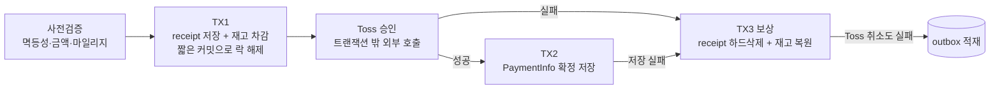

# 01. 주문/결제/재고 트랜잭션 파이프라인 — 정합성 + 복구 안전망

## 문제

기존 주문 저장은 하나의 `@Transactional` 안에서 주문 생성, 재고 비관락 선점·차감, Toss 결제 승인, 결제 정보 저장까지 모두 처리했습니다. 이 구조는 자동 롤백이 단순하다는 장점이 있지만, 외부 PG 호출이 재고 락 트랜잭션 안에 있어 Toss 응답 지연이 곧 락 점유 시간으로 이어지는 안티패턴이었습니다.

더 큰 문제는 실패를 복구하는 보상 루프가 충분하지 않다는 점이었습니다. Toss 취소나 보상 취소가 실패했을 때 DB에 남겨 재시도하는 outbox 경로가 없었고, Toss 결제 상태와 DB의 PaymentInfo를 주기적으로 대조하는 대사 작업도 없었습니다. 즉, Toss에서는 결제가 완료됐지만 DB에는 결제 정보가 남지 않는 경우 결제가 로컬에서 유실될 수 있었고, 관리자도 DB 기준 화면만으로는 해당 건을 발견하기 어려웠습니다.

운영 지표상 당시 `row_lock_time_avg`는 약 20ms였고 169일간 deadlock/timeout도 없어 즉시 장애가 난 상태는 아니었습니다. 그래서 처음에는 데이터를 근거로 보류했지만, 트래픽 스파이크나 핫 재고 상황에서 외부 I/O가 처리량 천장이 될 수 있고, 결제 실패 경로가 로컬 DB 안에서 끝까지 추적되지 않는다는 점을 함께 보고 예방적으로 분리·보강했습니다.

## 설계 판단

이 작업의 핵심은 "Toss 호출을 트랜잭션 밖으로 빼자"뿐만 아니라, 그 순간 잃어버리는 자동 롤백을 어떻게 복구할 것인가였습니다. 락은 커밋 때 풀리므로 락 점유를 줄이려면 Toss 호출 전에 재고 트랜잭션을 커밋해야 하고, 한 번 커밋한 DB 변경은 바깥 트랜잭션으로 자동 롤백할 수 없습니다. 결국 트랜잭션 분리는 보상 트랜잭션과 복구 레코드를 직접 설계하는 문제였습니다.

대안으로는 PaymentInfo(주문정보)를 PENDING 상태로 먼저 저장하는 방식, 주문 자체를 결제 후 생성하는 방식 등을 검토했습니다. 최종적으로는 PaymentInfo를 결제 시도나 PENDING 상태 표현에 쓰지 않고, 로컬 DB 안에서는 **`PaymentInfo가 있으면 확정 결제`로만 해석되게 유지**하는 것이 중요하다고 판단했습니다. 동시에 "결제됐는데 DB에 아무 기록도 없는" 블라인드 상황은 피해야 했기 때문에, 주문 기록(receipt)은 결제 전에 먼저 남기고 PaymentInfo는 Toss 승인 성공 후에만 생성하는 구조를 선택했습니다. 만약 Toss에는 결제가 있는데 PaymentInfo가 없는 orphan이 생기면, 이는 로컬 불변식으로 덮지 않고 PG 대사에서 외부 불일치로 탐지해 outbox 복구 경로로 보냅니다.

## 해결

최종 흐름은 `사전검증 → TX1 → Toss 승인 → TX2 → 실패 시 TX3 보상`으로 나눴습니다.

- **사전검증**: 회원, paymentKey 멱등성, 결제금액, 마일리지를 트랜잭션 밖에서 먼저 검증합니다.
- **TX1**: receipt, 상품 매핑, 수령 정보, 픽업 정보, 재고 차감을 짧은 트랜잭션으로 커밋하고 락을 해제합니다.
- **Toss 승인**: 외부 PG 호출은 DB 트랜잭션 밖에서 수행합니다.
- **TX2**: 승인 성공 후 확정 결제 정보로서 PaymentInfo를 저장하고 receipt에 연결한 뒤, 마일리지 차감과 장바구니 삭제를 완료합니다.
- **TX3 보상**: Toss 승인 실패 또는 후속 저장 실패 시 receipt와 하위 데이터를 하드삭제하고 재고를 복원합니다.

실패 주문에 `status`나 `isDeleted`를 두지 않고 하드삭제한 이유는 조회·집계·필터 전반에 실패 주문 분기가 번지는 것을 피하기 위해서입니다. 대신 돈이 실제로 묶일 수 있는 케이스는 outbox에 재시도 가능한 기록으로 남기도록 책임을 분리했습니다. 즉, **데이터 정리는 하드삭제가 담당하고 돈 복구는 outbox가 담당합니다.**

## 복구 안전망

복구는 "실패를 DB에 남기고, 자동으로 재시도하고, 그래도 안 되면 사람이 볼 수 있게 한다"는 방향으로 세 단계로 설계했습니다.

1. **쓰기 경로 보상**: Toss 승인 후 TX2가 실패하면 Toss 전체취소를 시도합니다. 이 전체취소마저 실패하면 `ORDER_SAVE_COMPENSATION` outbox를 paymentKey 기준으로 적재합니다.
2. **자동 재시도**: outbox 스케줄러가 10분 주기로 PENDING 작업을 선점해 Toss 취소를 재시도합니다. paymentInfo가 있는 부분취소는 paymentInfo 기준으로, paymentInfo가 없는 주문 저장 보상·orphan은 paymentKey 기준 전체취소로 처리합니다. `ALREADY_CANCELED`는 성공으로 해석해 재시도를 멱등하게 만들었습니다.
3. **PG 대사와 관리자 fallback**: 매일 04:00 Toss 거래내역을 직전 36시간 범위로 조회해, Toss에는 DONE 결제가 있는데 DB에는 PaymentInfo가 없는 orphan 결제를 찾습니다. 이미 PaymentInfo나 outbox가 있으면 건너뛰고, 없으면 `RECONCILE_ORPHAN` outbox에 적재해 기존 자동취소 경로에 합류시킵니다. 자동 재시도가 3회 실패하면 관리자 엑셀 대사에 `주문저장보상`과 `orphan` 섹션으로 노출하고, 관리자가 Toss 콘솔에서 수동 환불 후 paymentKey 기준으로 `RESOLVED_BY_ADMIN` 처리할 수 있게 했습니다.

## 결과 · 검증

동시 결제 race에서는 paymentKey UNIQUE 제약으로 한 건만 확정되게 하고, 패자가 보상 과정에서 Toss를 취소하면 승자의 결제까지 환불될 수 있으므로 race로 판별된 경우에는 로컬 흔적만 정리하고 승자의 주문 ID를 반환하도록 처리했습니다.

락 점유 구간은 "재고 락 ~ Toss 응답 포함 커밋"에서 "재고 락 ~ 짧은 DB 커밋"으로 줄었습니다. 분리 효과는 Grafana 전용 패널로 측정했습니다.

- **분리 전 baseline (HTTP 응답시간 기준)**: `POST /receipts` p95 **1,593ms** / p99 **1,750ms** — Toss 응답 지연이 그대로 재고 락 점유 시간에 포함되던 구간입니다. (분리 전에는 락 점유 타이머가 없어, 승인 호출이 같은 트랜잭션 안에 있던 구조 특성상 HTTP 응답시간을 상한선 비교 기준으로 사용)
- **분리 후 실측 (7일 관측)**: 재고 락 구간 p95/p99 약 **20~90ms**, 대부분 50ms 이하.

즉, 락 점유 구간이 "Toss 응답 포함 커밋(초 단위)"에서 "짧은 DB 커밋(수십 ms)"으로 분리됐음을 운영 지표로 확인했습니다.

상세 흐름도: [주문/결제/재고 복구 플로우 (mermaid.live)](https://mermaid.live/edit#pako:eNp1Vm1PG0cQ_iujkyKBQsIZn8GxSiLjc8AqNsgmkZK4QgccLyp-kX1WQ4HKpAdCwVJIA8IkxjUKCRC5qgOGEIl86U_JR-_6P3R29_zCQaz74NvbeeaZmWdmd1GaTEzpkkcCmJ5P_DY5q6UMGFOjceA_b8ezqETOs-TcpF-O6FoO6NstevIP_PcF6m9z9N1md62aJR_LtLgZlX7phDt37sMAs_lq4gdaWgGy9w2oWaKlTbgN9OA1OT2zoGonWfpxD80a3ga4uW8xKo0l0mm44reev6Dnhai0HI03tvvY9iVqfq6dni2Bil4ntHktPql7Y4lM3ABaOapVNtvwVY7vR_xaZZfuZZFBhZYKdGcTyL8XdNck73OQyBgTiedAXhzRvdwD7lBY-4W7nTVcX4KH6G4uPToTWUCHU9APRiqjs7SQV7u1i0p9dwsEYJt_C6G4zhEG7QjT2nxaB1oo0cMst7IFunFQzx0twdCNdj9NpLrvW9wx7bRYhlF_SA2EBq9ADfEURByN98Hme2Pl1i34vpXFB-hGqfalAPTQpMVVrJ8H6N4lPjA6CCSXpS_K1s6mWnqYXK5toi8P6GWWHpjk7zLP0OEB2yArHlluiibsbVFIZyZmUlpyFsIywxM0vr_51IaJMIlUclaLcxWdF6CDS6afs91A_DygOOlJobMt_-wX9j6z5DXoH4NuI6XF09qkMZeIp4HuV1DUDJsertCSCc7eWTQX_AZQNsLlA55rjsGkg_WsnZaYlTogFrhE2ELa0IxMul8dCfnbhMRpDIiabptkIw_dmNkqShCE2MkmljnsQ6LpX-eS9gCEpRV9_Z1JTqu4W0V65PgzefMZCZXru9t074LztJBHtYWYHjcC8ekET56lFK7FB3Zy6hWhhn03fbT6IOxHmmG_byTkCwz7x0fCo0PeENwoRE4nKXj8rC8Atgmp5BmbZItcd0qf1OeShpXFtuD1-NQVlVoZaPTrK5MB0v0qBrWJTcjSQDcKbL2ey2EW6lsmYdK8YDWqbx-TD_kGWth_rQ1aGnSwcXZ6VjtDub8uXVXzNVcYjEPGqQX0_SXSsdUuwrCsbDSG4ve1v2A0POLzRyKiWQWVnsYUbGLz9HW0pYqnqHBJjqvQllXULT2pCiF12gob6Wkbmag673DY71WfjPu8IZ9_2K8uQcSJDCOPfIyOkE9xi-6U21y1Rk8_G3n2CHuuzKqIgnCaYegxrOhtcNh3KyJY12JrVz84wS7IiIujoo7JIWquNb7aP77CVirjx150-dCLYlR5J-dXWOUEoR-pKdLLeQRvrH9Pe_33oXneAV3Ps-K3JhLdeU1Xs7YYg6zm-vNkImV42pMnpj35dEz299jJyAtW367S7UtUZ5683EI9r9PtfV4GNjZPq_TPFbGvA-VFyhe0lKXFD-JDJwrqK13NN7cLWqRSqJ2U2fmGo4G5Emdeh-iehlFDdkEWbCtCIcBvebq2ZUXLIqvv5sn5uj3MHgHA9CPygMpdJaUPpJjljVlc5VLPJOcT2pTd2CmMFX40Z8mbgscKHmSgVZyvl_AHMCniCmvl7bxNIUFF6K5g4khZgqALaSiyDIHQY-9wQB2PPAn5LJmPe4Mjj0JjdgoCoL52hs4QoBep4JConZr81Pua9zSi6L9-WcCNdj69QpTn68IaEfssStepjAcDkaB3zDdk5yRAmghuRIhpqV-9aaEhj70Zr14CTLxA4WiLjAw_9qvjA0_GvWowEPpRDzzkJXjKL3y2Kwy0yUnold2adi_Y4d1sIVHCp433oFu8S13STGpuSvIwfl1STE_FNPYqLbKdUcmY1WM4RDz4d0qf1jLzRlSKxpfRLKnFnyYSsYZlKpGZmZU8vG26pExySjN0dU7DJo01V1MYkZ7ysduf5HEprh6OInkWpeeSx-Fy33U7XW6lT5YV2Skr7i5pQfLccboddxWnG1dkxz23Q5b7lruk37lnx917fYrb5exTlF7F7ex1O5f_B8RXmbI)

## 관련 코드 (`code/`)

원본 위치: `be.weskey.*` (운영 레포 발췌)

| 파일 | 역할 |
|------|------|
| `ReceiptFacade.java` | 사전검증 → TX1 → Toss 승인 → TX2 → TX3 보상 오케스트레이션 |
| `ReceiptService.java` | 주문 저장/보상 트랜잭션 단위 구현 |
| `PaymentCancelOutbox.java` / `PaymentCancelOutboxStatus.java` | 취소 실패 복구 레코드 (outbox 엔티티/상태) |
| `PaymentCancelOutboxFacade.java` | outbox 재시도 처리 흐름 |
| `PaymentCancelOutboxScheduler.java` | 10분 주기 outbox 재시도 스케줄러 |
| `PaymentReconciliationFacade.java` / `PaymentReconciliationService.java` | Toss 거래내역 대사 — orphan 결제 탐지 |
| `PaymentReconciliationScheduler.java` | 매일 04:00 PG 대사 스케줄러 |
