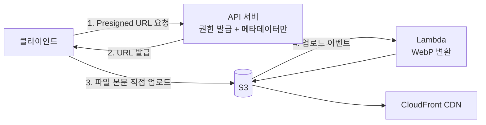
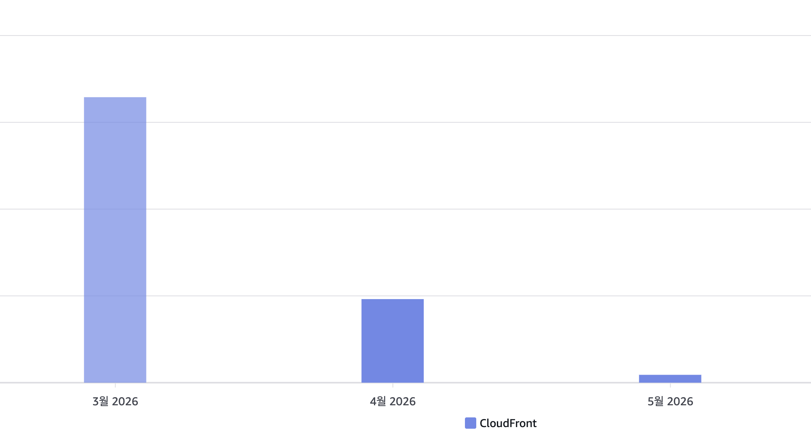

# 03. 이미지 처리 비용 약 90% 절감 — Presigned URL + Lambda WebP 변환

## 문제

사용자가 업로드한 원본 이미지가 큰 크기로 저장·전송되면서 S3 저장 비용과 CDN 전송 비용이 증가했습니다. 클라이언트 압축만으로는 기기·환경별 실패 가능성을 통제하기 어려웠고, 서버가 multipart 본문을 직접 받는 구조는 트래픽 증가 시 API 서버가 대용량 파일 전송 경로에 계속 묶이는 리스크가 있었습니다.

## 판단

비용 증가는 AWS Cost Explorer로 확인 가능한 문제였고, API 서버 부하는 당시 장애로 드러난 문제가 아니라 구조상 커질 수 있는 리스크였습니다. 따라서 비용 절감과 업로드 경로 분리를 목표로 잡았습니다.

## 해결

클라이언트가 서버에서 Presigned URL을 발급받아 S3로 직접 업로드하도록 전환하고, 업로드된 이미지는 Lambda에서 WebP로 변환하는 파이프라인으로 분리했습니다. API 서버는 업로드 권한 발급과 메타데이터 처리만 담당하고, 대용량 파일 본문은 S3와 Lambda가 처리하도록 역할을 나눴습니다.

## 결과 · 검증

AWS Cost Explorer에서 CloudFront 비용 추이를 확인한 결과, WebP 변환 파이프라인 적용 후 3월 대비 5월 이미지 전송 비용이 약 **90% 감소**했습니다. Presigned URL 전환은 API 서버가 multipart 파일 본문을 직접 받지 않게 만든 구조 개선이었고, WebP 변환은 이미지 파일 크기를 줄여 CDN 전송 비용을 낮춘 직접적인 절감 요인이었습니다.

CloudFront 비용 기준 전후 추이:

## 관련 코드 (`code/`)

| 파일 | 역할 |
|------|------|
| `FileController.java` | Presigned URL 발급 API |
| `FileService.java` | Presigned URL 생성 + 파일 메타데이터 처리 |
