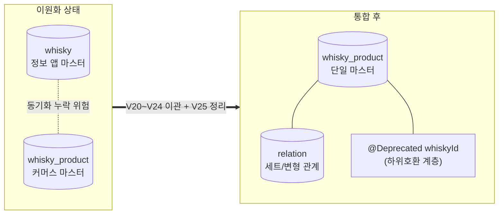

# 04. 제품 도메인 재설계 — 12개 테이블 무중단 이관과 하위호환 유지

## 문제

정보 앱으로 시작할 때는 `whisky`가 마스터 테이블이었지만, 커머스로 진화하면서 실제 운영 중심은 `whisky_product`로 이동했습니다. 그 결과 같은 제품이 두 도메인에 나뉘어 존재했고, 동기화가 누락되면 잘못된 제품 정보와 집계가 사용자에게 그대로 노출될 수 있었습니다. 문제는 개발 불편뿐만 아니라, 운영 중인 서비스가 서로 다른 두 기준으로 같은 제품을 해석하는 구조였습니다.

## 판단

이 작업의 핵심은 테이블을 합치는 것보다, 이미 배포된 앱이 기존 `whiskyId` 응답을 기대하는 상황에서 마스터 도메인을 바꾸는 것이었습니다. 그래서 `whisky_product`를 새 마스터로 승격하되, 레거시 응답 필드는 즉시 제거하지 않고 하위호환 계층으로 남기는 방향을 택했습니다.

세트/변형 상품은 단순 평탄화가 불가능했습니다. 테이스팅 노트는 개별 모상품 기준으로 작성되어야 했기 때문에, 세트 상품을 하나의 제품으로 합치면 노트와 집계가 오매핑될 수 있었습니다. 그래서 1단계 매핑 테이블을 신설해 세트/변형 관계를 명시적으로 표현했습니다.

## 해결

종속 테이블 12개를 새 제품 도메인 기준으로 이관하고 엔티티 9종을 제거했습니다. 삭제 대상은 `whisky`, `whisky_category`, `whisky_brand`, `whisky_taste`, `alcohol_whisky_info`, `alcohol_wine_info`, `whisky_info`, `whisky_info_mapping`, `price_location`, `whisky_recommend`(+ file), `whisky_recommend_title`, `whisky_product_whisky_mapping`이었습니다. 반대로 `whisky_star`, `whisky_product_category`, `whisky_product_category_mapping`, `whisky_product_search_ranking`은 유지하되 참조 기준만 `whisky_product`로 옮겼습니다.

다만 한 번에 제거하지 않고, 레거시 `whiskyId` 필드는 `@Deprecated`로 남긴 뒤 내부 값만 새 ID로 치환했습니다. 덕분에 앱 강제 업데이트 없이 기존 API 응답 계약을 유지하면서 서버 내부 마스터를 바꿀 수 있었습니다.

되돌리기 어려운 `DROP TABLE`과 레거시 필드 제거는 앱 완전 전환 이후로 격리했습니다. 1차 배포는 V20~V24로 컬럼 추가·relation 생성·데이터 백필만 수행하고, 2차 배포에서 구 컬럼과 구 테이블 삭제를 진행하는 방식으로 나눴습니다. 데이터 이관은 재실행 가능한 마이그레이션으로 나눠 작성했고, 운영 배포는 다운타임 없이 진행했습니다.

## 결과 · 검증

prod 덤프를 로컬로 복사해 dry-run을 먼저 돌리고, "구 테이블 노트 수 = 새 매핑 수 + 회원 업로드 전환 수" 등식과 orphan 0건, category NULL 0건으로 데이터 유실이 없음을 검산했습니다. 변형/세트 상품에 노트가 오매핑된 건이 0건인지, 세트 1건이 모상품 2개로 정확히 분리됐는지 이름 대조까지 확인했습니다.

이관 전 데이터는 `whisky_product` 2,027개, `whisky` 3,696개, `whisky_product_whisky_mapping` 2,061건, whisky 기반 테이스팅 노트 3,353건이었습니다. 이 중 매핑 불가능한 orphan 테이스팅 노트 932건은 삭제하지 않고 `WhiskyMemberUpload`로 전환했습니다. 추가로 운영 데이터에서 상품명 패턴으로 세트 후보 44건을 수동 검산했고, 누락 base relation 34행 보정, 잘못된 relation 삭제, `is_tasting_note_enabled=false` 보정을 후속 마이그레이션으로 분리했습니다.

마지막으로 운영 버전과 동일한 앱을 TestFlight에 올려 구버전 `whiskyId` 응답으로 노트 작성·조회가 정상 동작하는 것을 확인한 뒤 배포했습니다.

## 관련 코드 (`code/`)

데이터 이관 마이그레이션 (Flyway, 재실행 가능하게 분할):

| 파일 | 역할 |
|------|------|
| [`V20__add_whisky_product_consolidation_columns.sql`](./code/V20__add_whisky_product_consolidation_columns.sql) | 통합용 컬럼 추가 |
| [`V21__create_whisky_product_relation.sql`](./code/V21__create_whisky_product_relation.sql) | 세트/변형 관계 매핑 테이블 신설 |
| [`V22__add_whisky_product_id_to_tasting_note.sql`](./code/V22__add_whisky_product_id_to_tasting_note.sql) | 테이스팅 노트에 새 마스터 ID 연결 |
| [`V23__add_whisky_product_id_to_category_mapping.sql`](./code/V23__add_whisky_product_id_to_category_mapping.sql) | 카테고리 매핑에 새 마스터 ID 연결 |
| [`V24__migrate_whisky_to_whisky_product.sql`](./code/V24__migrate_whisky_to_whisky_product.sql) | 본 데이터 이관 |
| [`V25__cleanup_whisky_tables.sql`](./code/V25__cleanup_whisky_tables.sql) | 검증 후 레거시 컬럼·테이블 제거 |
